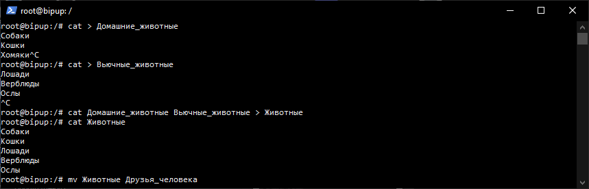
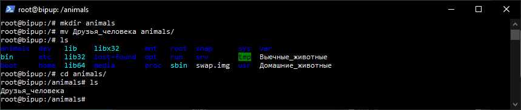
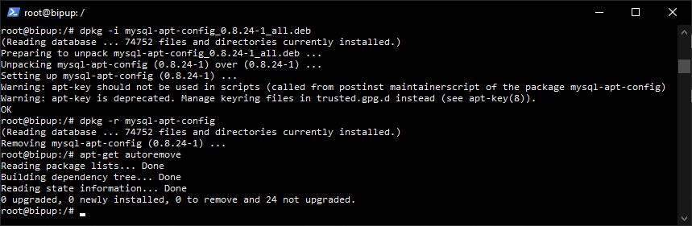
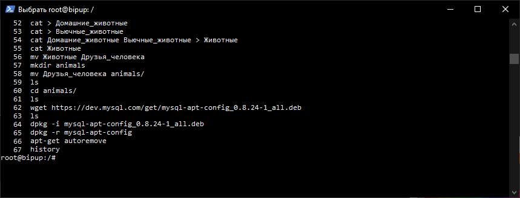
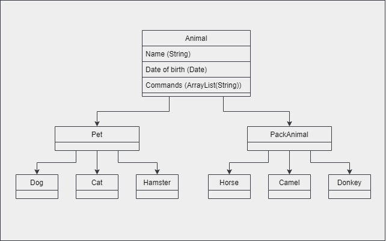

# `Итоговая контрольная работа по блоку специализация`

## Информация о проекте

Необходимо организовать систему учета для питомника в котором живут
домашние и вьючные животные.

## `Задание:`

1. При помощи команды cat создадим два файла *Домашние_животные* и *Вьючные_животные*. В первый запишем "*Собаки Кошки Хомяки*", а во второй "*Лошади Верблюды Ослы*". Далее объединим файлы в один, назвав его *Друзья_человека*.



2. Командой mkdir создадим директорию *animals* и переместим файл туда.



3. Скачаем конфигуратор mysql:
```
wget https://dev.mysql.com/get/mysql-apt-config_0.8.24-1_all.deb
```

4. Установим deb-пакет с помощью ```dpkg -i```. Удалим пакет командой ```dpkg -r```.



5. Для получения истории введенных команд в терминале ubuntu используем команду history.



6. Нарисуем диаграмму иерархии классов.



7. Напишем скрипт MySQ, который создаёт базу данных питомника.

[Скрипт с БД](nursery_db.sql)

13. Напишем программу, имитирующую работу реестра домашних животных.
[Код программы](Programm/)


